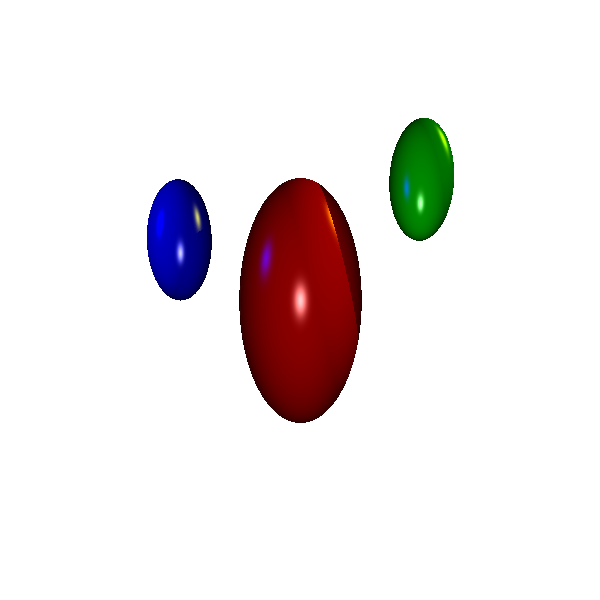

# raytracer


A simple raytracer written in C++.

<p align="center">
  
</p>

## Usage

Create a scene file specifying the location of the image plane, the resolution of the image, the objects in the scene, 
the lights in the scene, and the output file. 

For example:

```
NEAR 1
LEFT -1
RIGHT 1
BOTTOM -1
TOP 1

RES 600 600

SPHERE s1 0 0 -10 2 4 2 0.5 0 0 1 1 0.9 0 50
SPHERE s2 4 4 -10 1 2 1 0 0.5 0 1 1 0.9 0 50
SPHERE s3 -4 2 -10 1 2 1 0 0 0.5 1 1 0.9 0 50
SPHERE s4 0 0 -1 0.25 0.25 0.5 0 0 0.5 1 1 1 0 50

LIGHT l1 0 0 -1 0.3 0.3 0.3
LIGHT l2 10 10 -10 0.9 0.9 0
LIGHT l3 -10 5 -5 0 0 0.9

BACK 1 1 1
AMBIENT 0.2 0.2 0.2
OUTPUT testIllum.ppm
```

Then run the raytracer with the scene file as an argument:

```
./raytracer.exe scene.txt
```
